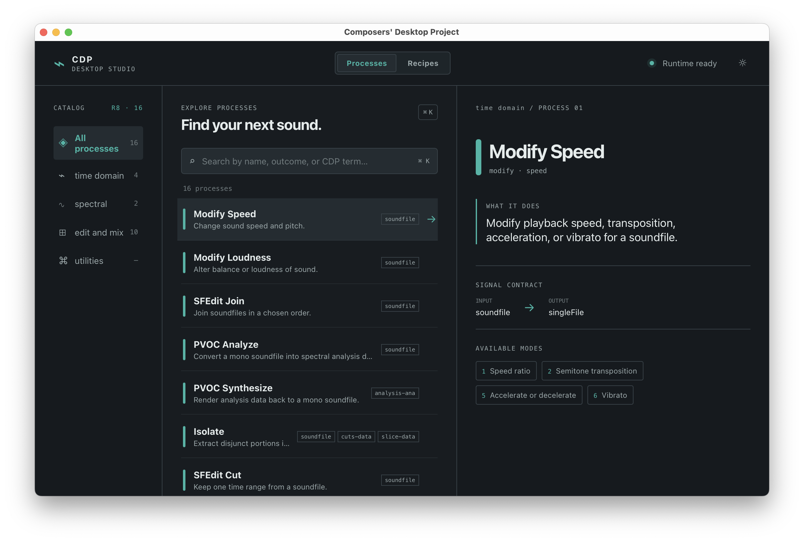

# Composers' Desktop Application

Composers' Desktop Application is an experimental desktop interface for the [Composers' Desktop Project (CDP)](https://www.composersdesktop.com/). It makes a reviewed subset of CDP's command-line audio processes accessible through searchable descriptions, generated forms, safe defaults, command previews, and native processing windows.



## Alpha status and safety

This first version is alpha software. It is a first draft of the software written with the aide of a coding agent, and the code has not received a complete human review. Features, process definitions, and file-handling behavior may contain defects.

Use the application at your own risk. Keep backups of source audio and other important files. Do not rely on this build for production work. The app avoids overwriting existing output files by design, but that safeguard does not replace backups or independent review.

## Current platform support

The current development target is **Intel macOS only** (`x86_64-apple-darwin`). The repository contains Intel Mach-O CDP executables and does not yet provide native Apple Silicon, Windows, or Linux sidecars.

Apple Silicon, Windows, and Linux support are planned. Each target needs matching CDP binaries, packaging, signing, and clean-machine testing before it can be supported. See the [cross-platform build guide](docs/app/05-cross-platform-builds.md) for the intended platform matrix.

## What the application does

The application combines a Vue 3 interface with a Rust and Tauri runtime. You can:

- Browse and search reviewed CDP processes by musical intent
- Configure process modes through generated input and parameter forms
- Inspect the exact command before running it
- Queue, cancel, and review processing jobs
- Audition soundfile results and pass compatible outputs to another process
- Follow guided recipes for selected multi-step workflows

Only reviewed catalog entries appear in the interface. The application does not expose every executable included with CDP Release 8.

## Roadmap and project documentation

The [product roadmap](docs/app/00-product-roadmap.md) describes the intended workflow, delivery milestones, current limitations, and later platform work. The remaining design and engineering documents define the contracts used by the application:

1. [Experience and visual design](docs/app/01-experience-and-visual-design.md)
2. [Process catalog contract](docs/app/02-process-catalog-contract.md)
3. [Desktop runtime and delivery](docs/app/03-desktop-runtime-and-delivery.md)
4. [Adding processes](docs/app/04-adding-processes.md)
5. [Cross-platform builds](docs/app/05-cross-platform-builds.md)

The roadmap includes native Apple Silicon, Windows, and Linux builds, broader process coverage, and expanded recipes. Platform support will be announced only after the relevant binaries and application bundles pass target-specific testing.

## Build locally on Intel macOS

Local development requires an Intel Mac or an Intel macOS environment. Install:

- [Bun](https://bun.sh/)
- [Rust](https://www.rust-lang.org/tools/install) with the `x86_64-apple-darwin` target
- [Tauri 2 prerequisites for macOS](https://v2.tauri.app/start/prerequisites/)
- The repository's `cdpr8` release tree, including `cdpr8/_cdp/_cdprogs/`

Install the JavaScript dependencies:

```sh
bun install
rustup target add x86_64-apple-darwin
```

Stage the approved CDP sidecars from the bundled release tree, explicitly
identifying the architecture they were built for:

```sh
bash scripts/stage-cdp-binaries.sh cdpr8/_cdp/_cdprogs x86_64-apple-darwin
```

Start the desktop application in development mode:

```sh
bun tauri dev
```

Run the automated checks before building a bundle:

```sh
bun run typecheck
bun test
cargo test --manifest-path src-tauri/Cargo.toml
bun run fmt:check
bun run lint
```

Build the Intel macOS application:

```sh
bun tauri build --target x86_64-apple-darwin
```

The local build is unsigned. Redistribution rights for the CDP binaries, code signing, notarization, and clean-machine validation remain release requirements.

## Versioning and releases

Release versions are stable `MAJOR.MINOR.PATCH` values and must match in
`package.json`, `src-tauri/Cargo.toml`, and `src-tauri/tauri.conf.json`.
Use `bun run bump:major`, `bun run bump:minor`, or `bun run bump:patch` to
update all three together. Before a release, run `bun run version:check`; it
rejects mismatches and the `0.0.0` development placeholder, and prints the
verified version for release automation.

A synchronized version change pushed to `master` runs the Intel macOS release
workflow. It publishes a `v<version>` GitHub prerelease containing the DMG only
after the full checks and committed-sidecar architecture validation pass. These
automated artifacts are currently unsigned and unnotarized alpha builds, so
publishing one does not promote Intel macOS to `released` platform status.

## Technology

The application uses Vue 3, TypeScript, Vite, Rust, and Tauri 2. Rust owns command compilation, binary resolution, validation, queueing, and process execution. The webview never accepts arbitrary executable paths or shell commands.

## Contributing

Treat every process definition as executable behavior. Follow the [process authoring guide](docs/app/04-adding-processes.md), verify the local documentation against executable help, and add frontend, Rust, and staged-binary tests with each process.

Because the project is in alpha and was developed with coding-agent assistance, contributions should prioritize human review, reproducible tests, safe file handling, and clear documentation of unresolved risks.
